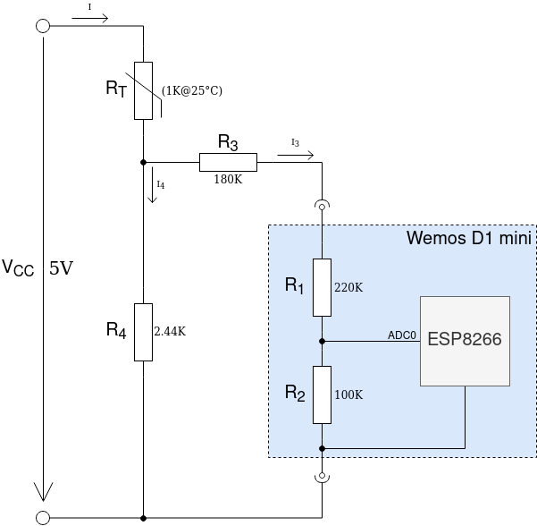

# sensor-gateway
Read analog values and forward to MQTT server

## Hardware setup

## Sensor Data Conversion

see jupyter-notebook

## References

## Jupyter, Numpy, Matplotlib

- [curve fitting - matplotlib](https://stackoverflow.com/questions/25030675/trouble-with-curve-fitting-matplotlib)
- [15 Tips and Tricks to Use Jupyter Notebook More Efficiently](https://towardsdatascience.com/15-tips-and-tricks-to-use-jupyter-notebook-more-efficiently-ef05ede4e4b9)
- [Basic Curve Fitting of Scientific Data with Python](https://towardsdatascience.com/basic-curve-fitting-of-scientific-data-with-python-9592244a2509)
- [Simple linear regression](https://en.wikipedia.org/wiki/Simple_linear_regression)
- [Working with Jupyter Notebooks in Visual Studio Code](https://code.visualstudio.com/docs/python/jupyter-support)

## TeX, LaTeX

- [LaTeX/Mathematics](https://en.wikibooks.org/wiki/LaTeX/Mathematics)